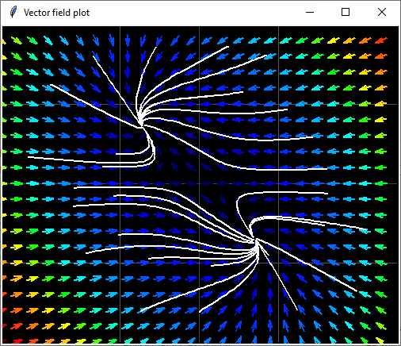
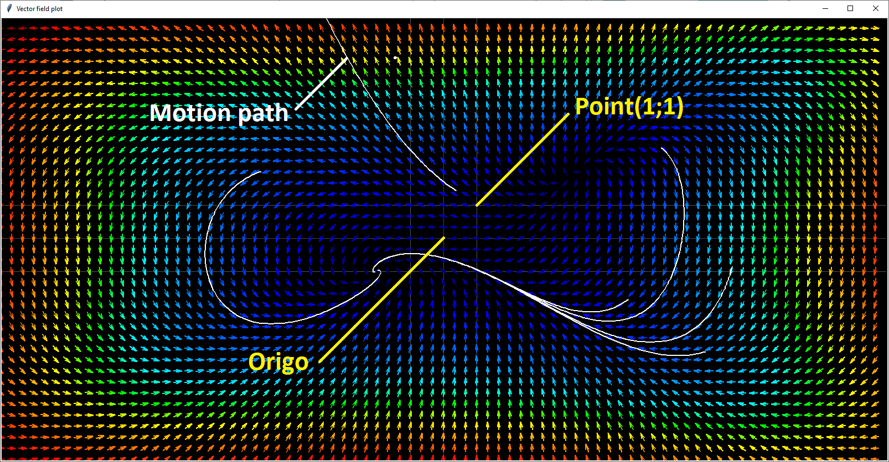
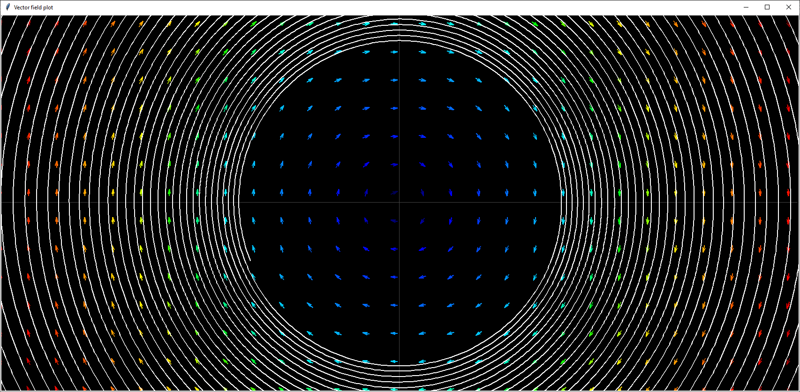
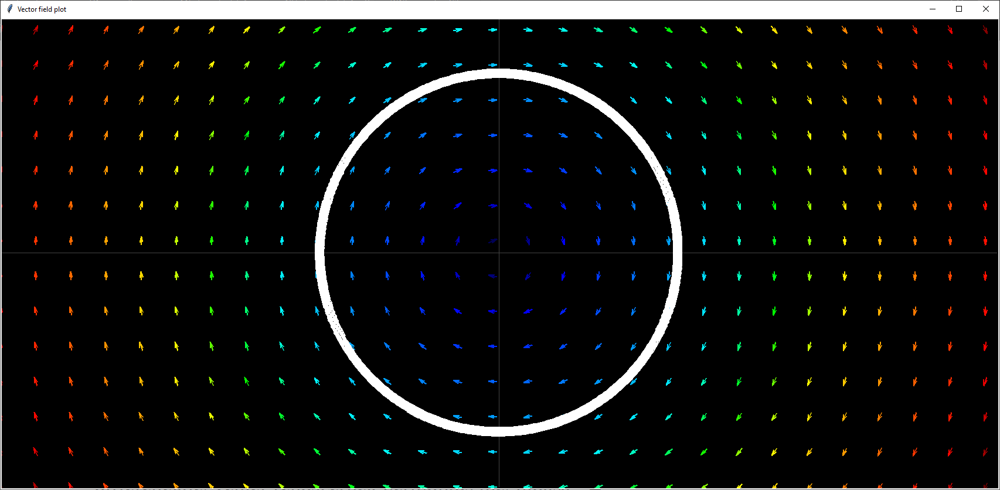
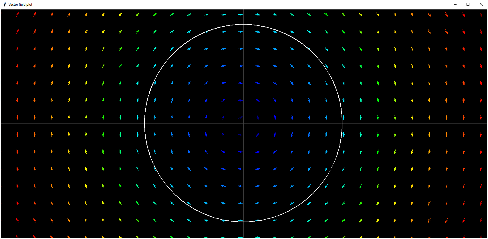

# Vector field and trajectory plotter

<p align="center">
<br>
Vector filed and trajectory
</p>

## Motivation of the project
The project was motivated by a course I took at university.
We learned how to examine the equilibrium stability of nonlinear second-order differential equations.
In this project, I have created a simple program to check the correctness of our analytical test.


## Usage
* First, replace the default equation in main.py. 
* Then run the program to examine the graph, and modify the parameters if you think it is necessary.
```console
python main.py
```
* With the Left-click, you can set an initial x, y position int the model. The numerical differential equation solver in this program will calculete the motion path of the model. 

* With the right button you can stop the calculation and delete the particular solution diagrams.

* Use the scroll wheel to zoom in.

## More details on how to use
There are some stop condition, but the most important is the variable called ***iter***. You can also set a higher value to make the simulation run longer, but this will be reflected in the computation time.


## The default variables
```python 
W, H  = 1600, 800 # Window size
zoom = 100 # Zoom level
dxy = 20 # vector filed plot distance delta
dt = 0.001 # simulation time delta
iter = 1e5 # simulation max iteration
```

## More about differential equation
Differential equations can be classified by type, order, linearity and homogeneity.
This program can be used to plot 2nd order homogeneous linear or nonlinear ordinary autonomous differential equations.

* Let's plot this differential equation.
$$
\begin{align}
\dot{x} &= -4y + 2xy -8\\
\dot{y} &= 4y^2 -x^2 
\end{align}
$$

* First modify the function, called vectorfield

```python 
def vectorfield(x, y):
    xp = -4 * y + 2 * x * y - 8
    yp = 4 * y**2 - x**2

    return xp, yp
```
In a function you can use any valid solution e.g. if statement.


* Then modify the parameters to something like this
```python 
W, H  = 1600, 800 # Window size
zoom = 100 # Zoom level
dxy = 20 # vector filed plot distance delta
dt = 0.001 # simulation time delta
iter = 1e5 # simulation max iteration
```
* Run the program in terminal
```console
python main.py
```
* With left-click you can view a path of the motion. The grid indicates the 1 uint position.
<p align="center">
<br>
Vector field and motion path
</p>


## Comment
* Make sure the simulation time is set correctly.
<p align="center">
<br>
dt = 0.01 [s]
</p>

<p align="center">
<br>
dt = 0.001 [s]
</p>

<p align="center">
<br>
dt = 0.0001 [s]
</p>


